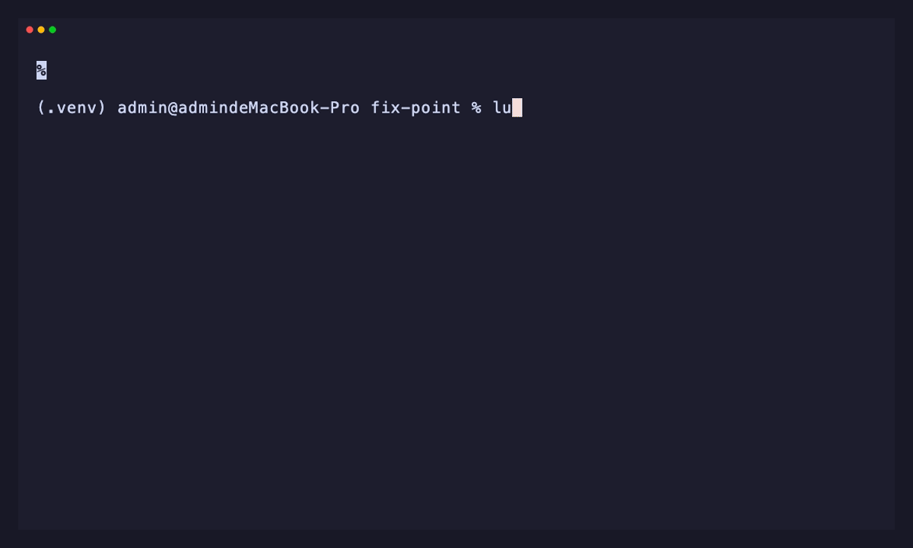
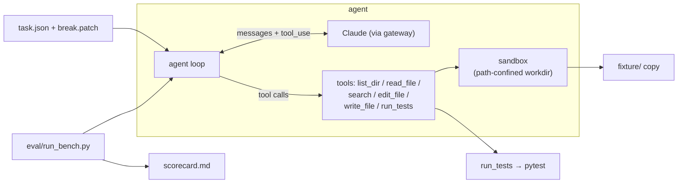

# Luna

> A test-driven autonomous coding agent, built from scratch.
> Hand it a repo and a red test suite — it locates the code, edits it, runs the
> tests, reads the red/green, and iterates until the suite is green. Then it's
> scored pass/fail on a controlled task set, with no self-reported results.

<!-- badges: keep to 3-4, all must be real & green -->


<!-- TODO(demo.gif): record 8–15s of one task going red → agent loop → green,
     save to docs/demo.gif, then uncomment the line below.

-->

## Why this exists

A coding agent built from scratch: hand it a repo with failing tests and it
locates the broken code, edits it, runs the tests, and iterates until green —
the core loop that tools like Claude Code run, small enough to read end-to-end.
What makes it more than a demo is measurement: every task is scored by a harness
that independently re-runs pytest, so **pass@1 is an observed number, never the
model's own word**.

## Architecture



## Quickstart

```bash
# Python 3.9 on macOS/Linux
python3.9 -m venv .venv
source .venv/bin/activate
pip install -r requirements.txt

# secrets: copy the template and fill in your gateway creds
cp .env.example .env
# edit .env → set ANTHROPIC_API_KEY and ANTHROPIC_BASE_URL

# solve a single task (streams the loop to your terminal)
python cli.py solve 001_mul_precedence

# run the whole benchmark → writes eval/scorecard.md
python cli.py bench

# —— v2: point it at YOUR git repo that has failing tests ——
python cli.py run /path/to/repo                 # locate + fix on a new branch, print the diff
python cli.py run /path/to/repo --python /path/to/repo/.venv/bin/python   # use the repo's own venv
```

## Results

<!-- from `python cli.py bench` (label=baseline): 12 controlled tasks, no retrieval / no self-correction -->

| model            | pass@1        | avg steps | avg tokens | avg cost |
|------------------|:-------------:|:---------:|:----------:|:--------:|
| claude-opus-4.8  | 100% (12/12)  |    6.3    |   22,142   |  $0.12   |

Full run: **$1.44** total · **~22 s/task** avg wall-clock. Every verdict is the harness
independently re-running pytest against the pristine tests — the model never grades itself.

### Ablations

<!-- baseline row is real; the others land with v1 (V8 retrieval, V9 haiku) -->

| variant                            | pass@1        | avg steps | avg cost |
|------------------------------------|:-------------:|:---------:|:--------:|
| opus-4.8 (baseline)                | 100% (12/12)  |    6.3    |  $0.120  |
| haiku-4.5 (weaker / cheaper brain) | 100% (12/12)  |    6.8    |  $0.036  |
| opus-4.8 + embedding retrieval     | 100% (12/12)  |    5.8    |  $0.179  |

> On this deliberately simple task set all three variants solve every task (a ceiling
> effect), so the signal is **efficiency, not solve-rate**:
> - **haiku** matches opus at **~3× lower cost** (a couple more steps) — the benchmark
>   doesn't punish the weaker model here.
> - **embedding retrieval** cuts steps (6.3 → 5.8; e.g. the division-stub task dropped
>   8 → 4 steps, since retrieval hands the agent the exact broken function) but *raises*
>   cost (~+50%): the injected code is re-sent in every turn's history (MVP doesn't trim),
>   so the step savings don't pay for the token overhead — yet. Trimming history or gating
>   injection would flip that.
>
> Separating variants on solve-rate would need a harder task set (future work). n_attempts=1.

## How it works

- **The loop** (`agent/loop.py`) — a ReAct cycle: the model sees the task, calls
  tools, observes results, iterates. Bounded by `max_steps` and a per-task USD cost
  budget; it stops when the model quits calling tools (or a guardrail trips).
- **The tools** (`agent/tools.py`) — `list_dir`, `read_file` (numbered lines),
  `search` (literal grep), `edit_file` (unique-match string replace), `write_file`,
  `run_tests` (pytest → compact PASS/FAIL). Every path is confined to the task
  workdir by `agent/sandbox.py`; errors come back as strings, never exceptions.
- **The task set** — a single pristine `fixture/`: a compact arithmetic-expression
  evaluator in three stages — `tokenizer` (source → tokens), `parser` (tokens → AST
  via recursive descent, with real operator precedence, left-associativity, and
  unary minus), and `evaluator` (AST → number; true division, divide-by-zero
  raises), over a shared `errors` hierarchy. The pristine library is fully green:
  51 pytest cases across the three stages plus end-to-end integration. Each task
  then applies a `break.patch` that breaks exactly one function, turning a known
  subset of those tests red; the agent has to make the suite green again.
- **Scoring** — after the agent stops, the harness restores the pristine test
  files (so a run can't cheat by editing tests), then independently re-runs the
  full `pytest`. A task is *solved* iff its target tests pass **and** no
  previously-green test newly fails (regression check). The model is never
  trusted to grade itself.

## Run on a real repo 

`python cli.py run <repo>` points the same agent at **any git repo that has failing
tests** and fixes them to green — the fixture task set, generalized to real code:

- **Oracle = the failing tests.** It runs your suite, takes the currently-failing tests
  as the goal, edits the source, and re-runs. *Solved* = those tests pass **and** no
  previously-green test regresses (the same harness judge as the benchmark). It never
  hunts for bugs without a failing test to prove them.
- **Safe by default.** Requires a clean tree, works on a fresh `fixpoint/fix-<ts>`
  branch, **never commits or resets your work**, and prints the diff for you to keep or
  discard. Refuses non-git dirs, subdirectories, and mid-merge/rebase states.
- **Uses your repo's interpreter** (`--python`, or an auto-detected `<repo>/.venv`) so the
  target's own dependencies are visible to pytest.
- **pytest by default** (per-test verdicts + regression detection); other runners work
  via `--test-cmd "…"`, judged by exit code only.

```bash
python cli.py run ~/proj --target tests/test_x.py::test_y     # narrow the goal
python cli.py run ~/proj --test-cmd "make test" --budget 2.0 --max-steps 60
```

### Chat UI —— Luna

A chat frontend over the same runner — paste a repo path, she fixes the red tests
and replies with a result card (baseline → fixed/regressions → branch → cost → diff):

```bash
python serve.py            # → http://127.0.0.1:8000  (Ctrl-C to stop)
```

Stdlib `http.server`, no extra deps, split by concern: **transport** (`serve.py` —
server + routing + static files), **logic** (`web_backend.py` — parse the message,
chat or fix, no HTTP), and **presentation** (`web/` — `index.html` / `style.css` /
`app.js`). A message with a path goes through the exact same `run_repo` pipeline as
the CLI and returns a result card; a message without one gets a persona chat reply
(cheap/fast model, with a canned fallback). A time-aware greeting (client-side), a
catgirl avatar + sidebar, and a pastel/night theme via `prefers-color-scheme`. Drop
any image at `assets/luna.png` (or `.jpg`/`.webp`) to use your own portrait —
otherwise the built-in SVG is used. **Local only** — it binds `127.0.0.1` and runs
the target repo's tests (arbitrary code), so point it only at repos you trust.

## Project layout

```text
agent/    loop, tools, sandbox, llm, config, profile
tasks/    fixture/ (pristine lib + tests) + NNN_*/ (task.json + break.patch)
eval/     run_bench.py (benchmark), run_repo.py (v2 real-repo runner), scorecard.md
tests/    unit tests for the agent's own tools + profile / run_repo
cli.py    solve / bench / run entrypoints
serve.py      local chat UI —— HTTP 服务器 + 路由 + 静态分发（薄入口）
web_backend.py    its logic: parse message → chat_reply / run_fix (no HTTP)
web/          its frontend: index.html + style.css + app.js
```

## Limitations & non-goals

- **Needs a failing test as the oracle.** It fixes red tests to green; it does *not*
  proactively hunt for bugs when nothing is failing (no oracle → unverifiable).
- **Structured verdicts are pytest-only.** Other runners work via `--test-cmd` but are
  judged by exit code alone (no per-test detail / regression breakdown).
- Edits are exact string replacements (`edit_file`), not fuzzy / semantic patches.
- Real-repo safety is git-based (clean tree + branch + diff), **not** a container —
  run it only on repos you trust (the test command executes arbitrary code).
- Cost / latency depend on the aggregation gateway; it can't report output tokens under
  streaming, so `run` / `bench` use non-streaming for accurate cost.
- Not bit-reproducible: the LLM samples, so steps / cost vary run to run.
- Embedding retrieval (v1) is English-only (`bge-small-en`); its benefit here is modest
  (see Ablations).

## License

MIT
