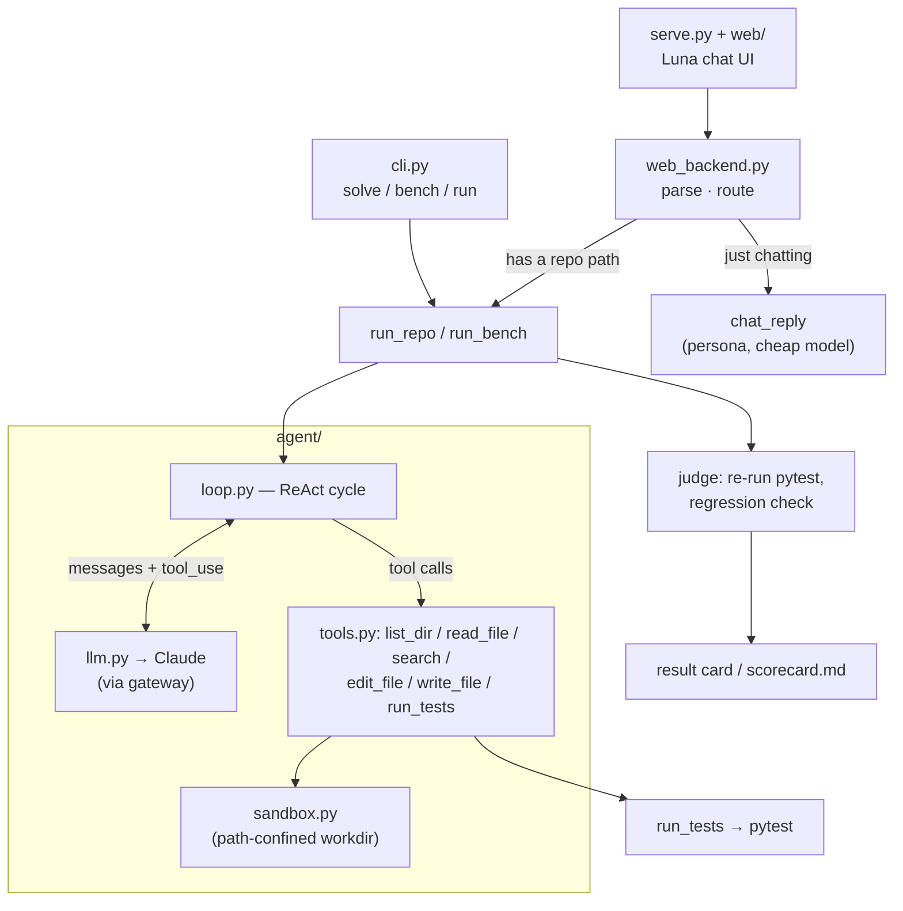

# Luna

> A test-driven autonomous coding agent, built from scratch — with a cat-eared face.
> Hand it a repo and a red test suite; it locates the code, edits it, runs the tests,
> reads the red/green, and iterates until the suite is green. Every result is scored by
> an independent harness, so **pass@1 is an observed number, never the model's own word**.
> Drive it from the CLI, or chat with **卢娜 (Luna)**, the catgirl assistant on the front.

<!-- badges: keep to 3-4, all must be real & green -->


<!-- TODO(demo.gif): record 8–15s of one task going red → agent loop → green,
     save to docs/demo.gif, then uncomment the line below.

-->

## What it is

Luna is a coding agent built from scratch: hand it a repo with failing tests and it
locates the broken code, edits it, runs the tests, and iterates until green — the core
loop that tools like Claude Code run, small enough to read end-to-end. What makes it
more than a demo is **measurement**: every task is scored by a harness that independently
re-runs pytest and checks for regressions, so the solve-rate is observed, not claimed.

Two ways in, one engine:

- **CLI** (`cli.py`) — `solve` a benchmark task, `bench` the whole controlled set, or
  `run` the agent on any real git repo with failing tests.
- **Chat** (`serve.py` + `web/`) — a local web app where **卢娜 (Luna)**, a cat-eared code
  assistant, takes a repo path in plain language, fixes the red tests, and replies with a
  result card. She'll also just chat back if you say hi.

Both funnel into the same agent loop and the same test-oracle scoring.

## Feature tour

- **Test-oracle scoring** — the model never grades itself; a separate harness re-runs
  pytest against pristine tests and flags regressions.
- **Real-repo mode** — point it at your own git repo; safe by default (clean-tree check,
  fresh branch, never commits or resets your work, prints the diff).
- **Path-confined tools** — every file op is sandboxed to the work directory; the test
  command is the only thing that runs your code.
- **Benchmark + ablations** — a 12-task controlled set with a reproducible scorecard
  (model / retrieval ablations included).
- **Streaming, retrieval, budgets** — live token streaming, optional embedding retrieval
  to seed context, and a per-task USD cost ceiling.
- **Chat frontend** — natural-language path extraction, persona small-talk, a time-aware
  greeting, a polished result card, and a drop-in portrait slot — all on stdlib
  `http.server`, no extra deps.

## Architecture



## Quickstart

```bash
# Python 3.9 on macOS/Linux
python3.9 -m venv .venv
source .venv/bin/activate
pip install -r requirements.txt

# secrets: copy the template and fill in your gateway creds
cp .env.example .env
# edit .env → set ANTHROPIC_API_KEY and ANTHROPIC_BASE_URL

# solve a single benchmark task (streams the loop to your terminal)
python cli.py solve 001_mul_precedence

# run the whole benchmark → writes eval/scorecard.md
python cli.py bench

# fix YOUR git repo that has failing tests (new branch, prints the diff)
python cli.py run /path/to/repo
python cli.py run /path/to/repo --python /path/to/repo/.venv/bin/python

# …or chat with 卢娜 in the browser
python serve.py            # → http://127.0.0.1:8000  (Ctrl-C to stop)
```

## Results

<!-- from `python cli.py bench` (label=baseline): 12 controlled tasks, no retrieval / no self-correction -->

| model            | pass@1        | avg steps | avg tokens | avg cost |
|------------------|:-------------:|:---------:|:----------:|:--------:|
| claude-opus-4.8  | 100% (12/12)  |    6.3    |   22,142   |  $0.12   |

Full run: **$1.44** total · **~22 s/task** avg wall-clock. Every verdict is the harness
independently re-running pytest against the pristine tests — the model never grades itself.

### Ablations

| variant                            | pass@1        | avg steps | avg cost |
|------------------------------------|:-------------:|:---------:|:--------:|
| opus-4.8 (baseline)                | 100% (12/12)  |    6.3    |  $0.120  |
| haiku-4.5 (weaker / cheaper brain) | 100% (12/12)  |    6.8    |  $0.036  |
| opus-4.8 + embedding retrieval     | 100% (12/12)  |    5.8    |  $0.179  |

> On this deliberately simple task set all three variants solve every task (a ceiling
> effect), so the signal is **efficiency, not solve-rate**:
> - **haiku** matches opus at **~3× lower cost** (a couple more steps) — the benchmark
>   doesn't punish the weaker model here.
> - **embedding retrieval** cuts steps (6.3 → 5.8; e.g. the division-stub task dropped
>   8 → 4 steps, since retrieval hands the agent the exact broken function) but *raises*
>   cost (~+50%): the injected code is re-sent in every turn's history (MVP doesn't trim),
>   so the step savings don't pay for the token overhead — yet. Trimming history or gating
>   injection would flip that.
>
> Separating variants on solve-rate would need a harder task set (future work). n_attempts=1.

## How it works

- **The loop** (`agent/loop.py`) — a ReAct cycle: the model sees the task, calls tools,
  observes results, iterates. Bounded by `max_steps` and a per-task USD cost budget; it
  stops when the model quits calling tools (or a guardrail trips). Optional live streaming
  and embedding retrieval to seed context.
- **The tools** (`agent/tools.py`) — `list_dir`, `read_file` (numbered lines), `search`
  (literal grep), `edit_file` (unique-match string replace), `write_file`, `run_tests`
  (pytest → compact PASS/FAIL). Every path is confined to the work directory by
  `agent/sandbox.py`; errors come back as strings, never exceptions.
- **The LLM seam** (`agent/llm.py`) — one thin wrapper over the Anthropic SDK (through an
  aggregation gateway), owning retries, streaming, and token/cost accounting. `agent/config.py`
  is the single knob panel (model, budgets, timeouts, price table).
- **The task set** (`tasks/fixture/`) — a compact arithmetic-expression evaluator in three
  stages: `tokenizer` (source → tokens), `parser` (tokens → AST via recursive descent, with
  real operator precedence, left-associativity, and unary minus), and `evaluator` (AST →
  number; true division, divide-by-zero raises), over a shared `errors` hierarchy. Pristine,
  it's fully green: 51 pytest cases. Each `tasks/NNN_*/` applies a `break.patch` that breaks
  exactly one function, turning a known subset of those tests red.
- **Scoring** (`eval/run_bench.py`) — after the agent stops, the harness restores the
  pristine test files (so a run can't cheat by editing tests), then independently re-runs the
  full `pytest`. A task is *solved* iff its target tests pass **and** no previously-green test
  newly fails (regression check).

## Run on a real repo

`python cli.py run <repo>` points the same agent at **any git repo that has failing tests**
and fixes them to green — the fixture task set, generalized to real code (via `eval/run_repo.py`):

- **Oracle = the failing tests.** It runs your suite, takes the currently-failing tests as
  the goal, edits the source, and re-runs. *Solved* = those tests pass **and** no
  previously-green test regresses. It never hunts for bugs without a failing test to prove them.
- **Safe by default.** Requires a clean tree, works on a fresh `luna/fix-<ts>` branch,
  **never commits or resets your work**, and prints the diff for you to keep or discard.
  Refuses non-git dirs, subdirectories,
  and mid-merge/rebase states. Restores any test file the agent touched before judging.
- **Uses your repo's interpreter** (`--python`, or an auto-detected `<repo>/.venv`) so the
  target's own dependencies are visible to pytest.
- **pytest by default** (per-test verdicts + regression detection); other runners work via
  `--test-cmd "…"`, judged by exit code only.

```bash
python cli.py run ~/proj --target tests/test_x.py::test_y     # narrow the goal
python cli.py run ~/proj --test-cmd "make test" --budget 2.0 --max-steps 60
```

## Chat with 卢娜 (Luna)

```bash
python serve.py            # → http://127.0.0.1:8000
```

Just tell her, in plain language: *「帮我改一下 bug，仓库路径是 /path/to/repo」*. She pulls
the path out of the sentence, runs the exact same `run_repo` pipeline as the CLI, and replies
with a result card (baseline → fixed / regressions → branch → cost → diff). No path in your
message? She chats back in character instead of erroring.

The frontend is stdlib `http.server` with no extra deps, split by concern:

- **transport** — `serve.py`: HTTP server, routing, static file serving.
- **logic** — `web_backend.py`: `parse_message` (path extraction), `chat_reply` (persona
  small-talk on a cheap/fast model, with a canned fallback), `run_fix` (→ `run_repo`), and
  `handle_run` that routes between them. Pure dict-in/dict-out, so it's testable offline.
- **presentation** — `web/`: `index.html` / `style.css` / `app.js`, plus a hand-drawn SVG
  catgirl. A time-aware greeting (client-side), a pastel/night theme via `prefers-color-scheme`,
  and a polished result card. Drop any image at `assets/luna.png` (`.jpg`/`.webp` too) to use
  your own portrait — otherwise the built-in SVG is used.

**Local only** — it binds `127.0.0.1` and runs the target repo's tests (arbitrary code), so
point it only at repos you trust.

## Project layout

```text
agent/            the agent itself
  loop.py           ReAct loop (run_agent) + optional retrieval
  tools.py          list_dir / read_file / search / edit_file / write_file / run_tests
  sandbox.py        path confinement + per-task workspaces
  llm.py            Anthropic-via-gateway wrapper + token/cost accounting
  config.py         single knob panel (model, budgets, price table) + cost_of
  profile.py        remembers your name for the CLI greeting
tasks/            fixture/ (pristine evaluator lib + tests) + 001..012/ (task.json + break.patch)
eval/
  run_bench.py      the benchmark: run each task, judge, write scorecard.md
  run_repo.py       real-repo runner (git preflight → agent → restore tests → judge)
tests/            121 unit tests for tools / sandbox / llm / loop / config / profile / run_repo
cli.py            solve / bench / run entrypoints
serve.py          Luna chat UI — HTTP server + routing + static dispatch (thin)
web_backend.py    its logic: parse message → chat_reply / run_fix (no HTTP)
web/              its frontend: index.html + style.css + app.js
assets/           luna.* portrait (optional; falls back to the built-in SVG)
```

## Configuration

Credentials and knobs come from the environment (via `.env`):

| variable             | purpose                                                        |
|----------------------|----------------------------------------------------------------|
| `ANTHROPIC_API_KEY`  | gateway key (**required**)                                     |
| `ANTHROPIC_BASE_URL` | gateway base URL (**required**)                                |
| `LUNA_MODEL`     | override the model id (optional; defaults to opus-4.8)         |
| `LUNA_TEST_CMD`  | default test command for real-repo runs (optional)            |
| `PORT`               | chat server port (optional; default `8000`)                   |

Secrets are read straight from the environment and never enter `Config`, logs, or artifacts.

## Testing

```bash
python -m pytest -q        # 121 tests, all offline (agent runs are monkeypatched)
```

The suite covers the tools, sandbox path-confinement, the LLM wrapper, the loop, config, the
name profile, and the real-repo orchestrator — none of it hits the gateway.

## Limitations & non-goals

- **Needs a failing test as the oracle.** It fixes red tests to green; it does *not*
  proactively hunt for bugs when nothing is failing (no oracle → unverifiable).
- **Structured verdicts are pytest-only.** Other runners work via `--test-cmd` but are judged
  by exit code alone (no per-test detail / regression breakdown).
- Edits are exact string replacements (`edit_file`), not fuzzy / semantic patches.
- Real-repo and chat safety is git-based (clean tree + branch + diff) and localhost-only,
  **not** a container — run only on repos you trust (the test command executes arbitrary code).
- Cost / latency depend on the aggregation gateway; it can't report output tokens under
  streaming, so `run` / `bench` use non-streaming for accurate cost.
- Not bit-reproducible: the LLM samples, so steps / cost vary run to run.
- Embedding retrieval is English-only (`bge-small-en`); its benefit here is modest (see Ablations).

## License

MIT
