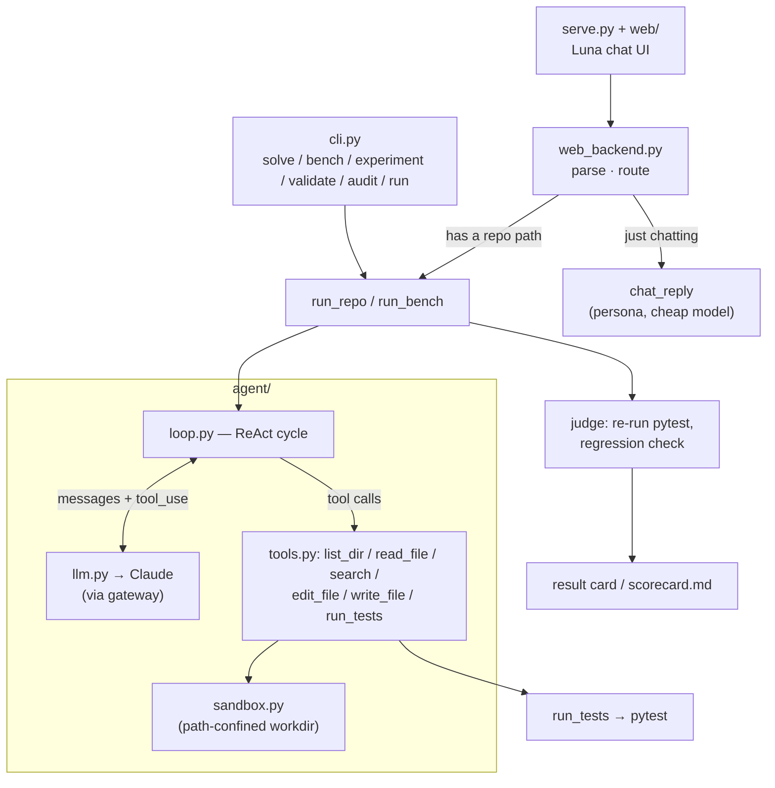
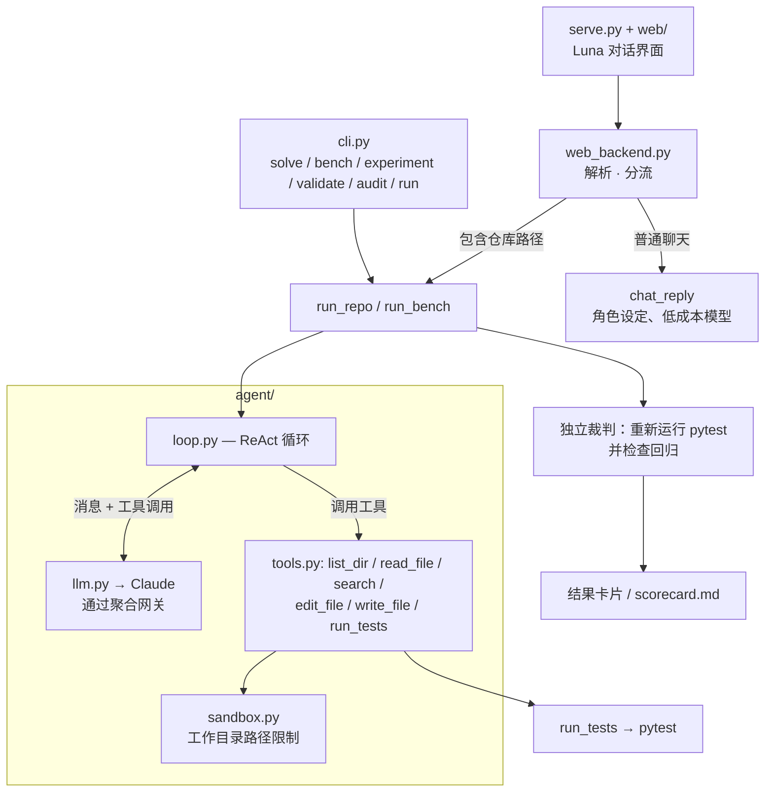

# Luna

[English](#luna) | [Chinese](#chinese-version)

> A test-driven autonomous coding agent, built from scratch — with a cat-eared face.
> Hand it a repo and a red test suite; it locates the code, edits it, runs the tests,
> reads the red/green, and iterates until the suite is green. Every result is scored by
> an independent harness, so **pass@1 is an observed number, never the model's own word**.
> Drive it from the CLI, or chat with **Luna**, the catgirl assistant on the front.

<!-- badges: keep to 3-4, all must be real & green -->

[](https://github.com/Tsukishiro-Hitomi/Luna/actions/workflows/ci.yml)


<!-- TODO(demo.gif): record 8–15s of one task going red → agent loop → green,
     save to docs/demo.gif, then uncomment the line below.

-->

## What it is

Luna is a coding agent built from scratch: hand it a repo with failing tests and it
locates the broken code, edits it, runs the tests, and iterates until green — the core
loop that tools like Claude Code run, small enough to read end-to-end. What makes it
more than a demo is **measurement**: every task is scored by a harness that independently
re-runs pytest and checks for regressions, so the solve-rate is observed, not claimed.

Two ways in, one engine:

- **CLI** (`cli.py`) — `solve` a benchmark task, `bench` the whole controlled set,
  `audit` committed evidence, or `run` the agent on a real git repo with failing tests.
- **Chat** (`serve.py` + `web/`) — a local web app where **Luna**, a cat-eared code
  assistant, takes a repo path in plain language, fixes the red tests, and replies with a
  result card. She'll also just chat back if you say hi.

Both funnel into the same agent loop and the same test-oracle scoring.

## Feature tour

- **Test-oracle scoring** — the model never grades itself; a separate harness re-runs
  pytest against pristine tests and flags regressions.
- **Real-repo mode** — point it at your own git repo; safe by default (clean-tree check,
  fresh branch, never commits or resets your work, prints the diff).
- **Path-confined tools** — every file op is sandboxed to the work directory; the test
  command is the only thing that runs your code.
- **Benchmark + ablations** — 30 controlled repair tasks across three independent Python
  fixtures, with offline validity gates and resumable repeated experiments.
- **Streaming, retrieval, budgets** — live token streaming, optional embedding retrieval
  to seed context, and a per-task USD cost ceiling.
- **Chat frontend** — natural-language path extraction, persona small-talk, a time-aware
  greeting, a polished result card, and a drop-in portrait slot — all on stdlib
  `http.server`, no extra deps.

## Architecture



## Quickstart

```bash
# Python 3.9–3.12 on macOS/Linux
python3 -m venv .venv
source .venv/bin/activate
pip install -e ".[dev]"

# optional: install the embedding-retrieval dependency too
# pip install -e ".[dev,retrieval]"

# secrets: copy the template and fill in your gateway creds
cp .env.example .env
# edit .env → set ANTHROPIC_API_KEY and ANTHROPIC_BASE_URL

# solve a single benchmark task (streams the loop to your terminal)
luna solve 001_mul_precedence

# run the whole benchmark → writes eval/scorecard.md
luna bench

# fix YOUR git repo that has failing tests (new branch, prints the diff)
luna run /path/to/repo
luna run /path/to/repo --python /path/to/repo/.venv/bin/python

# …or chat with Luna in the browser
python serve.py            # → http://127.0.0.1:8000  (Ctrl-C to stop)
```

`pip install -r requirements.txt` remains available as a compatibility path. Benchmark and
web assets intentionally live in the source checkout, so editable installation is the
recommended development setup.

## Results

The official `multi_repo_v1` campaign ran all 30 tasks three times per condition: **270
independently judged attempts** from one clean commit (`acdbc5e`) and one frozen task digest.
Harness errors remain in the denominator; this run had none.

| variant | solved attempts | solve rate (95% Wilson CI) | steps mean±sd | cost mean±sd |
|---|:---:|:---:|:---:|:---:|
| opus-4.8 baseline | 90/90 | 100% (95.9%–100%) | 6.37±0.88 | $0.1319±0.0313 |
| haiku-4.5 | 90/90 | 100% (95.9%–100%) | 8.26±1.47 | $0.0378±0.0131 |
| opus-4.8 + embedding retrieval | 90/90 | 100% (95.9%–100%) | 5.71±0.96 | $0.1468±0.0379 |

Total estimated campaign cost was **$28.49**. Every condition solved every attempt in each
fixture (expression: 36/36, config loader: 27/27, dependency planner: 27/27).

The task set still shows a ceiling effect, so the useful signal is efficiency rather than
solve-rate separation:

- **Haiku** was about **3.5× cheaper** than baseline, with 1.89 more steps on average.
- **Retrieval** saved 0.66 steps on average, but added 3,204 tokens and $0.0149 per paired
  attempt. On this dataset, the step reduction still does not pay for the injected context.

These are controlled synthetic repairs with three attempts per task, not a claim of universal
repository repair. See the committed [report](eval/artifacts/multi_repo_v1/report.md),
[summary](eval/artifacts/multi_repo_v1/summary.json), and all 270
[attempt records](eval/artifacts/multi_repo_v1/attempts.jsonl).

## Engineering evidence

- **Installable CLI:** `pyproject.toml` exposes the `luna` command with separated core,
  development, and optional retrieval dependencies.
- **Automated quality gate:** GitHub Actions runs the offline suite on Python 3.9, 3.11, and
  3.12, compiles the source, validates all benchmark patches, and audits published evidence.
- **Tamper-evident results:** `luna audit` rebuilds every committed summary and report from
  raw JSONL attempts, rejects duplicate attempt IDs, scans artifacts for secrets/local paths,
  and validates the real-case registry.
- **Explicit external-validity boundary:** real-repository results are indexed with a pinned
  commit, issue, license, reproduction, and status, and are never mixed into controlled pass@1.

## How it works

- **The loop** (`agent/loop.py`) — a ReAct cycle: the model sees the task, calls tools,
  observes results, iterates. Bounded by `max_steps` and a per-task USD cost budget; it
  stops when the model quits calling tools (or a guardrail trips). Optional live streaming
  and embedding retrieval to seed context.
- **The tools** (`agent/tools.py`) — `list_dir`, `read_file` (numbered lines), `search`
  (literal grep), `edit_file` (unique-match string replace), `write_file`, `run_tests`
  (pytest → compact PASS/FAIL). Every path is confined to the work directory by
  `agent/sandbox.py`; errors come back as strings, never exceptions.
- **The LLM seam** (`agent/llm.py`) — one thin wrapper over the Anthropic SDK (through an
  aggregation gateway), owning retries, streaming, and token/cost accounting. `agent/config.py`
  is the single knob panel (model, budgets, timeouts, price table).
- **The task set** (`tasks/`) — 30 repair tasks across three independent, standard-library
  Python fixtures: an expression evaluator (12 tasks / 51 tests), a layered configuration
  loader (9 / 28), and a dependency planner (9 / 22). Tasks carry fixture, difficulty, tag,
  and provenance metadata. `luna validate` proves each pristine suite is green,
  each patch turns its declared targets red, reverse-patching restores the baseline, and
  fixture source remains unchanged.
- **Scoring** (`eval/run_bench.py`) — after the agent stops, the harness restores the
  pristine test files (so a run can't cheat by editing tests), then independently re-runs the
  full `pytest`. A task is *solved* iff its target tests pass **and** no previously-green test
  newly fails (regression check).

## Repeated experiments

The `experiment` command runs resumable multi-attempt campaigns and preserves every terminal
attempt in JSONL. Reports include means, sample standard deviations, medians, 95% Wilson
intervals, per-fixture/difficulty breakdowns, and paired deltas against baseline.

```bash
luna validate
luna experiment --campaign multi_repo_v1 --attempts 3 \
  --variants baseline,haiku,retrieval --cost-cap 40 --publish
luna audit
```

Official publish mode requires a clean Git tree and writes a secret-free manifest, raw
attempts, summary, and report under `eval/artifacts/<campaign>/`. Scratch campaigns remain
ignored under `eval/results/`.

## Run on a real repo

`python cli.py run <repo>` points the same agent at **any git repo that has failing tests**
and fixes them to green — the fixture task set, generalized to real code (via `eval/run_repo.py`):

- **Oracle = the failing tests.** It runs your suite, takes the currently-failing tests as
  the goal, edits the source, and re-runs. *Solved* = those tests pass **and** no
  previously-green test regresses. It never hunts for bugs without a failing test to prove them.
- **Safe by default.** Requires a clean tree, works on a fresh `luna/fix-<ts>` branch,
  **never commits or resets your work**, and prints the diff for you to keep or discard.
  Refuses non-git dirs, subdirectories,
  and mid-merge/rebase states. Restores any test file the agent touched before judging.
- **Uses your repo's interpreter** (`--python`, or an auto-detected `<repo>/.venv`) so the
  target's own dependencies are visible to pytest.
- **pytest by default** (per-test verdicts + regression detection); other runners work via
  `--test-cmd "…"`, judged by exit code only.

```bash
python cli.py run ~/proj --target tests/test_x.py::test_y     # narrow the goal
python cli.py run ~/proj --test-cmd "make test" --budget 2.0 --max-steps 60
```

### Real-repository case study

Luna was also evaluated on the public Pallets `itsdangerous` issue
[#237](https://github.com/pallets/itsdangerous/issues/237), pinned immediately before the
upstream fix. With tracked regression tests, the repository started at 421 passed / 16 failed.
Luna repaired both `Signer` and `Serializer` in 12 steps for an estimated $0.4187; the
independent full-suite verdict was **437 passed / 0 failed / 0 regressions**. Reproduction,
provenance, license, metrics, and the generated patch are stored in
[`eval/real_cases/itsdangerous_237/`](eval/real_cases/itsdangerous_237/).

The machine-readable [`eval/real_cases/index.json`](eval/real_cases/index.json) registry pins
the provenance and reproduction contract. This is reported as one case study, not included
in controlled-benchmark pass@1.

Three additional public repairs have passed the offline reproduction gate but have **not**
been run through Luna, so they are reported as reproduced candidates rather than successes:

| candidate | domain | verified pre-fix verdict | upstream-fix verdict | Luna status |
|---|---|---:|---:|---|
| Click #3578 | CLI help rendering | 1655 passed / 2 failed | 1657 passed / 0 failed | not run |
| Packaging #1345 | requirement/marker parsing | 62353 passed / 3 failed | 62356 passed / 0 failed | not run |
| cattrs #688 | nested generic structuring | 883 passed / 2 failed | 885 passed / 0 failed | not run |

Their test-only patches, pinned dependencies, preparation scripts, and exact scopes are in
[`eval/real_cases/`](eval/real_cases/). Paid solving remains a separate, explicitly approved
stage, preventing case selection from being biased toward hidden successful runs.

## Chat with Luna

```bash
python serve.py            # → http://127.0.0.1:8000
```

Just tell her, in plain language: *"Fix the bug in the repo at /path/to/repo."* She pulls
the path out of the sentence, runs the exact same `run_repo` pipeline as the CLI, and replies
with a result card (baseline → fixed / regressions → branch → cost → diff). No path in your
message? She chats back in character instead of erroring.

The frontend is stdlib `http.server` with no extra deps, split by concern:

- **transport** — `serve.py`: HTTP server, routing, static file serving.
- **logic** — `web_backend.py`: `parse_message` (path extraction), `chat_reply` (persona
  small-talk on a cheap/fast model, with a canned fallback), `run_fix` (→ `run_repo`), and
  `handle_run` that routes between them. Pure dict-in/dict-out, so it's testable offline.
- **presentation** — `web/`: `index.html` / `style.css` / `app.js`, plus a hand-drawn SVG
  catgirl. A time-aware greeting (client-side), a pastel/night theme via `prefers-color-scheme`,
  and a polished result card. Drop any image at `assets/luna.png` (`.jpg`/`.webp` too) to use
  your own portrait — otherwise the built-in SVG is used.

**Local only** — it binds `127.0.0.1` and runs the target repo's tests (arbitrary code), so
point it only at repos you trust.

## Project layout

```text
agent/            the agent itself
  loop.py           ReAct loop (run_agent) + optional retrieval
  tools.py          list_dir / read_file / search / edit_file / write_file / run_tests
  sandbox.py        path confinement + per-task workspaces
  llm.py            Anthropic-via-gateway wrapper + token/cost accounting
  config.py         single knob panel (model, budgets, price table) + cost_of
  profile.py        remembers your name for the CLI greeting
tasks/            30 repair tasks + task authoring guide
  fixtures/         expression + config_loader + dependency_planner
eval/
  run_bench.py      the benchmark: run each task, judge, write scorecard.md
  experiment.py     resumable attempts, manifests, statistics, and reports
  audit.py          recompute published evidence + validate the real-case registry
  run_repo.py       real-repo runner (git preflight → agent → restore tests → judge)
  real_cases/       pinned real-repository reproductions and Luna patches
tests/            offline tests for the Agent, CLI/Web boundaries, harness, and evidence
cli.py            solve / bench / experiment / validate / audit / run entrypoints
serve.py          Luna chat UI — HTTP server + routing + static dispatch (thin)
web_backend.py    its logic: parse message → chat_reply / run_fix (no HTTP)
web/              its frontend: index.html + style.css + app.js
assets/           luna.* portrait (optional; falls back to the built-in SVG)
```

## Configuration

Credentials and knobs come from the environment (via `.env`):

| variable             | purpose                                                        |
|----------------------|----------------------------------------------------------------|
| `ANTHROPIC_API_KEY`  | gateway key (**required**)                                     |
| `ANTHROPIC_BASE_URL` | gateway base URL (**required**)                                |
| `LUNA_MODEL`     | override the model id (optional; defaults to opus-4.8)         |
| `LUNA_TEST_CMD`  | default test command for real-repo runs (optional)            |
| `PORT`               | chat server port (optional; default `8000`)                   |

Secrets are read straight from the environment and never enter `Config`, logs, or artifacts.

## Testing

```bash
python -m pytest -q        # all offline; agent runs are monkeypatched
luna validate             # prove every benchmark patch has the intended red/green behavior
luna audit                # recompute committed reports and validate real-case provenance
```

The suite covers tools, path confinement, the LLM wrapper, loop, config, multi-fixture
validation, experiment statistics and resume behavior, real-case artifact integrity, and the
real-repo orchestrator — none of it hits the gateway.

## Limitations & non-goals

- **Needs a failing test as the oracle.** It fixes red tests to green; it does *not*
  proactively hunt for bugs when nothing is failing (no oracle → unverifiable).
- **Structured verdicts are pytest-only.** Other runners work via `--test-cmd` but are judged
  by exit code alone (no per-test detail / regression breakdown).
- Edits are exact string replacements (`edit_file`), not fuzzy / semantic patches.
- Real-repo and chat safety is git-based (clean tree + branch + diff) and localhost-only,
  **not** a container — run only on repos you trust (the test command executes arbitrary code).
- Cost / latency depend on the aggregation gateway; it can't report output tokens under
  streaming, so `run` / `bench` use non-streaming for accurate cost.
- Not bit-reproducible: the LLM samples, so steps / cost vary run to run.
- Embedding retrieval is English-only (`bge-small-en`); its benefit here is modest (see Ablations).

## License

MIT

---

<a id="chinese-version"></a>

# 中文版本

> 一个从零构建、由测试驱动的自主编程 Agent——还带着一张猫耳面孔。
> 给它一个仓库和一组失败的测试，它会定位代码、修改文件、运行测试、读取红绿结果，
> 并持续迭代，直到测试全部通过。每次运行都由独立评测器打分，因此 **pass@1 是实际观测值，
> 而不是模型的自我评价**。你既可以通过 CLI 使用它，也可以在前端与猫娘代码助手 Luna 对话。


[](https://github.com/Tsukishiro-Hitomi/Luna/actions/workflows/ci.yml)


<!-- TODO(demo.gif)：录制一个 8–15 秒的演示，展示单个任务从测试失败到 Agent 迭代、
     再到测试通过的过程，保存为 docs/demo.gif，然后取消下面一行的注释。

-->

## 项目简介

Luna 是一个从零构建的编程 Agent：给它一个存在失败测试的仓库，它会定位问题代码、
修改文件、运行测试，并不断迭代直到测试通过。这是 Claude Code 等工具所采用的核心循环，
但本项目规模足够小，可以完整阅读。它与普通演示项目的区别在于**可度量性**：每项任务都由
独立评测器重新运行 pytest 并检查回归，因此解决率来自实际观测，而不是模型声称的结果。

两个入口，共用一个引擎：

- **CLI**（`cli.py`）——可用 `solve` 解决单个基准任务，用 `bench` 运行完整受控任务集，
  用 `audit` 审计已提交证据，或用 `run` 在真实 Git 仓库中运行 Agent。
- **对话界面**（`serve.py` + `web/`）——本地 Web 应用。猫耳代码助手 Luna 可以从自然语言中
  获取仓库路径、修复失败测试，并返回结果卡片；如果只是向她问好，她也可以正常聊天。

两个入口最终都会进入同一套 Agent 循环和测试预言机评分流程。

## 功能概览

- **测试预言机评分**——模型不为自己打分；独立评测器会使用原始测试重新运行 pytest 并检测回归。
- **真实仓库模式**——可以指向自己的 Git 仓库；默认检查工作区是否干净、新建分支、绝不自动提交
  或重置用户改动，并在结束时打印 diff。
- **路径受限工具**——所有文件操作都被限制在工作目录内；只有测试命令会执行目标仓库的代码。
- **基准测试与消融实验**——包含 3 个独立 Python fixture、30 个受控修复任务、离线有效性闸门，
  并支持可恢复的重复实验。
- **流式输出、检索与预算**——支持实时 token 流、可选的 embedding 检索，以及单任务美元成本上限。
- **对话前端**——支持自然语言路径提取、角色闲聊、随时间变化的问候、结果卡片和可替换立绘；
  全部基于标准库 `http.server`，无需额外 Web 框架。

## 架构



## 快速开始

```bash
# macOS/Linux，Python 3.9–3.12
python3 -m venv .venv
source .venv/bin/activate
pip install -e ".[dev]"

# 可选：同时安装 embedding 检索依赖
# pip install -e ".[dev,retrieval]"

# 复制密钥模板，并填写聚合网关凭据
cp .env.example .env
# 编辑 .env，设置 ANTHROPIC_API_KEY 和 ANTHROPIC_BASE_URL

# 解决单个基准任务，并在终端中流式显示 Agent 过程
luna solve 001_mul_precedence

# 运行完整基准测试，并写入 eval/scorecard.md
luna bench

# 修复你自己的、存在失败测试的 Git 仓库（新建分支并打印 diff）
luna run /path/to/repo
luna run /path/to/repo --python /path/to/repo/.venv/bin/python

# 或者在浏览器中与 Luna 对话
python serve.py            # → http://127.0.0.1:8000（按 Ctrl-C 停止）
```

仍可使用 `pip install -r requirements.txt` 作为兼容安装方式。基准数据和 Web 资源有意保留在
源码仓库中，因此开发时推荐使用 editable install。

## 实验结果

正式的 `multi_repo_v1` campaign 对 30 个任务、每种条件各运行三次：共 **270 次独立判定尝试**，
全部来自同一个干净提交（`acdbc5e`）和同一个固定任务摘要。Harness 错误不会被移出分母；本次为 0。

| 实验条件 | 已解决尝试 | 解决率（95% Wilson 区间） | 平均步数±标准差 | 平均成本±标准差 |
|---|:---:|:---:|:---:|:---:|
| opus-4.8 baseline | 90/90 | 100%（95.9%–100%） | 6.37±0.88 | $0.1319±0.0313 |
| haiku-4.5 | 90/90 | 100%（95.9%–100%） | 8.26±1.47 | $0.0378±0.0131 |
| opus-4.8 + embedding 检索 | 90/90 | 100%（95.9%–100%） | 5.71±0.96 | $0.1468±0.0379 |

完整 campaign 的估算总成本为 **$28.49**。每种条件在三个 fixture 中都解决了全部尝试
（表达式：36/36，配置加载器：27/27，依赖规划器：27/27）。

任务集仍然存在天花板效应，因此有效信号是效率，而不是解决率差异：

- **Haiku** 的成本约比 baseline 低 **3.5 倍**，代价是平均多 1.89 步。
- **检索**平均减少 0.66 步，但每次成对尝试增加了 3,204 token 和 $0.0149。在当前数据集上，
  减少的步骤仍不足以抵消注入上下文的成本。

这些是每题三次的受控合成修复实验，不代表可以普遍修复任意仓库。完整数据见已提交的
[实验报告](eval/artifacts/multi_repo_v1/report.md)、[统计摘要](eval/artifacts/multi_repo_v1/summary.json)
和全部 270 条[尝试记录](eval/artifacts/multi_repo_v1/attempts.jsonl)。

## 工程化证据

- **可安装 CLI：** `pyproject.toml` 提供 `luna` 命令，并区分核心依赖、开发依赖和可选检索依赖。
- **自动质量闸门：** GitHub Actions 在 Python 3.9、3.11 和 3.12 上运行离线测试、编译检查、
  benchmark 补丁验证和已发布证据审计。
- **可检测篡改的结果：** `luna audit` 从原始 JSONL 重新生成每份已提交 summary 和报告，检查重复
  attempt ID、密钥与本机路径，并验证真实案例注册表。
- **明确的外部有效性边界：** 真实仓库案例必须记录固定提交、Issue、许可证、复现方式和状态，
  且绝不混入受控 benchmark 的 pass@1。

## 工作原理

- **核心循环**（`agent/loop.py`）——ReAct 循环：模型读取任务、调用工具、观察结果并持续迭代。
  `max_steps` 和单任务美元预算会限制运行；模型不再调用工具或触发护栏时停止。支持可选的流式输出
  和 embedding 上下文检索。
- **工具层**（`agent/tools.py`）——提供 `list_dir`、带行号的 `read_file`、字面量 `search`、
  唯一匹配的 `edit_file`、`write_file` 和将 pytest 输出压缩为 PASS/FAIL 的 `run_tests`。
  所有路径都通过 `agent/sandbox.py` 限定在工作目录内；错误始终返回字符串而不是向循环抛异常。
- **LLM 接口层**（`agent/llm.py`）——对 Anthropic SDK 的薄封装，通过聚合网关调用模型，统一负责
  重试、流式输出和 token/成本统计。`agent/config.py` 集中管理模型、预算、超时和价格表。
- **任务集**（`tasks/`）——30 个修复任务，分布在三个仅依赖标准库的独立 Python fixture：
  表达式求值器（12 题 / 51 个测试）、分层配置加载器（9 / 28）和依赖规划器（9 / 22）。任务包含
  fixture、难度、标签和来源元数据。`luna validate` 会证明每个纯净测试集全绿、每份补丁
  都能让声明目标变红、反向补丁能恢复基线，并且验证过程不会改变 fixture 源码。
- **评分系统**（`eval/run_bench.py`）——Agent 停止后，评测器恢复原始测试，防止通过修改测试作弊，
  然后独立运行完整 pytest。只有目标测试全部通过并且没有原本为绿的测试发生回归时，任务才算解决。

## 重复实验

`experiment` 命令可以运行和恢复多次尝试，并将每个已结束的尝试立即保存为 JSONL。报告包含均值、
样本标准差、中位数、95% Wilson 区间、按 fixture/难度的分组结果，以及相对于 baseline 的成对差异。

```bash
luna validate
luna experiment --campaign multi_repo_v1 --attempts 3 \
  --variants baseline,haiku,retrieval --cost-cap 40 --publish
luna audit
```

正式发布模式要求 Git 工作区干净，并在 `eval/artifacts/<campaign>/` 下写入不含密钥的 manifest、
原始尝试、统计摘要和报告。临时实验仍写入被忽略的 `eval/results/`。

## 在真实仓库上运行

`python cli.py run <repo>` 会让同一个 Agent 面向一个**存在失败测试的 Git 仓库**工作，
将 fixture 任务集中的流程推广到真实代码（实现位于 `eval/run_repo.py`）：

- **失败测试就是预言机。** 工具首先运行测试套件，将当前失败的测试作为目标，修改源码后重新运行。
  “已解决”表示原本失败的测试变绿，并且原本通过的测试没有变红。没有失败测试时，它不会主动寻找
  无法通过测试证明的潜在缺陷。
- **默认安全。** 要求工作区干净，在新的 `luna/fix-<ts>` 分支上工作，绝不自动提交或重置用户改动，
  并打印最终 diff。它会拒绝非 Git 目录、仓库子目录以及正在 merge/rebase 的仓库，并在判定前恢复
  Agent 修改过的测试文件。
- **使用目标仓库的解释器。** 可以通过 `--python` 指定，或自动检测 `<repo>/.venv`，以便 pytest
  能加载目标项目自己的依赖。
- **默认使用 pytest。** pytest 模式提供逐测试判定和回归检测；也可以通过 `--test-cmd "…"`
  使用其他测试命令，但此时只能根据退出码做粗粒度判断。

```bash
python cli.py run ~/proj --target tests/test_x.py::test_y     # 缩小目标范围
python cli.py run ~/proj --test-cmd "make test" --budget 2.0 --max-steps 60
```

### 真实仓库案例

Luna 还在 Pallets 公开的 `itsdangerous`
[#237](https://github.com/pallets/itsdangerous/issues/237) 上进行了测试，代码固定在上游修复前的提交。
加入可追踪的回归测试后，基线为 421 passed / 16 failed。Luna 用 12 步同时修复了 `Signer` 和
`Serializer`，估算成本为 $0.4187；独立全量复判结果为 **437 passed / 0 failed / 0 回归**。
复现方法、来源、许可证、指标和生成的补丁保存在
[`eval/real_cases/itsdangerous_237/`](eval/real_cases/itsdangerous_237/)。

机器可读的 [`eval/real_cases/index.json`](eval/real_cases/index.json) 注册表固定了来源和复现约定。
这是一个单独案例，不计入受控 benchmark 的 pass@1。

另外三个公开修复已经通过离线复现闸门，但**尚未交给 Luna 求解**，因此只标记为已复现候选，
而不是成功案例：

| 候选案例 | 领域 | 修复前复判 | 上游修复复判 | Luna 状态 |
|---|---|---:|---:|---|
| Click #3578 | CLI 帮助文本渲染 | 1655 passed / 2 failed | 1657 passed / 0 failed | 未运行 |
| Packaging #1345 | requirement/marker 解析 | 62353 passed / 3 failed | 62356 passed / 0 failed | 未运行 |
| cattrs #688 | 嵌套泛型结构化 | 883 passed / 2 failed | 885 passed / 0 failed | 未运行 |

它们的纯测试补丁、固定依赖、准备脚本和准确测试范围保存在
[`eval/real_cases/`](eval/real_cases/) 中。付费求解仍是需要单独批准的下一阶段，从而避免先隐藏运行、
再只挑成功案例展示的选择偏差。

## 与 Luna 对话

```bash
python serve.py            # → http://127.0.0.1:8000
```

只需要用自然语言告诉她：*“帮我修一下 bug，仓库路径是 /path/to/repo。”* 她会从句子中提取路径，
调用完全相同的 `run_repo` 流程，并返回结果卡片，包括基线、修复数量、回归、分支、成本和 diff。
如果消息中没有路径，她会以角色设定正常聊天，而不是返回错误。

前端只使用标准库 `http.server`，并按职责拆分：

- **传输层**——`serve.py`：HTTP 服务、路由和静态文件分发。
- **逻辑层**——`web_backend.py`：`parse_message` 提取路径，`chat_reply` 使用低成本模型完成角色闲聊
  并提供静态兜底，`run_fix` 调用 `run_repo`，`handle_run` 负责分流。函数输入输出都是普通字典，
  因此可以脱离 HTTP 离线测试。
- **展示层**——`web/`：`index.html`、`style.css` 和 `app.js`，以及内置的手绘 SVG 猫娘。
  支持客户端时间问候、通过 `prefers-color-scheme` 切换的柔和/夜间主题，以及结果卡片。
  可以将自己的图片放到 `assets/luna.png`（也支持 `.jpg`/`.webp`）；没有图片时使用内置 SVG。

**仅限本地使用**——服务只监听 `127.0.0.1`，但会运行目标仓库的测试，而测试本质上是任意代码；
因此只应将它用于你信任的仓库。

## 项目结构

```text
agent/            Agent 核心实现
  loop.py           ReAct 循环（run_agent）与可选检索
  tools.py          list_dir / read_file / search / edit_file / write_file / run_tests
  sandbox.py        路径限制与逐任务临时工作区
  llm.py            Anthropic 聚合网关封装与 token/成本统计
  config.py         模型、预算、价格表和 cost_of 的集中配置
  profile.py        记录用户名，用于 CLI 问候
tasks/            30 个修复任务 + 任务编写指南
  fixtures/         expression + config_loader + dependency_planner
eval/
  run_bench.py      运行任务、独立判定并生成 scorecard.md
  experiment.py     可恢复尝试、manifest、统计和报告
  audit.py          重算已发布证据并验证真实案例注册表
  run_repo.py       真实仓库流程：Git 预检 → Agent → 恢复测试 → 独立判定
  real_cases/       固定版本的真实仓库复现与 Luna 补丁
tests/            Agent、CLI/Web 边界、harness 与证据产物的离线测试
cli.py            solve / bench / experiment / validate / audit / run 命令入口
serve.py          Luna 对话界面：HTTP 服务、路由与静态分发
web_backend.py    解析消息并分流到 chat_reply / run_fix 的业务逻辑
web/              index.html + style.css + app.js
assets/           可选的 luna.* 立绘；不存在时使用内置 SVG
```

## 配置

凭据和运行参数通过环境变量（`.env`）提供：

| 环境变量 | 用途 |
|---|---|
| `ANTHROPIC_API_KEY` | 聚合网关密钥（**必填**） |
| `ANTHROPIC_BASE_URL` | 聚合网关地址（**必填**） |
| `LUNA_MODEL` | 覆盖模型 ID（可选，默认 opus-4.8） |
| `LUNA_TEST_CMD` | 真实仓库模式的默认测试命令（可选） |
| `PORT` | 对话服务端口（可选，默认 `8000`） |

密钥直接从环境变量读取，绝不会进入 `Config`、日志或实验产物。

## 测试

```bash
python -m pytest -q        # 全部离线运行，Agent 调用使用 monkeypatch 替换
luna validate             # 证明每份 benchmark 补丁都满足预期红绿行为
luna audit                # 重算已提交报告并验证真实案例来源
```

测试覆盖工具、路径限制、LLM 封装、Agent 循环、配置、多 fixture 验证、实验统计与恢复逻辑、
真实案例产物完整性和真实仓库编排流程，不会访问模型网关。

## 限制与非目标

- **需要失败测试作为预言机。** 它负责将红测试修绿；当所有测试都通过时，不会主动搜索缺乏验证标准的 bug。
- **只有 pytest 支持结构化判定。** 其他测试命令可以通过 `--test-cmd` 使用，但只能根据退出码判断，
  无法提供逐测试明细或回归列表。
- 编辑操作使用精确字符串替换，不支持模糊匹配或语义补丁。
- 真实仓库与对话模式的安全边界是 Git 干净树、新分支、diff 和本地监听，**不是容器**；
  测试命令可以执行任意代码，因此只能用于可信仓库。
- 成本和延迟取决于聚合网关。该网关在流式模式下不返回 output token，因此 `run` 和 `bench`
  默认使用非流式请求，以获得准确成本。
- LLM 存在采样随机性，因此运行结果无法做到逐 bit 复现，步数和成本可能发生变化。
- Embedding 检索只针对英文语料（`bge-small-en`），并且在当前任务集上的收益有限，详见消融实验。

## 许可证

MIT
