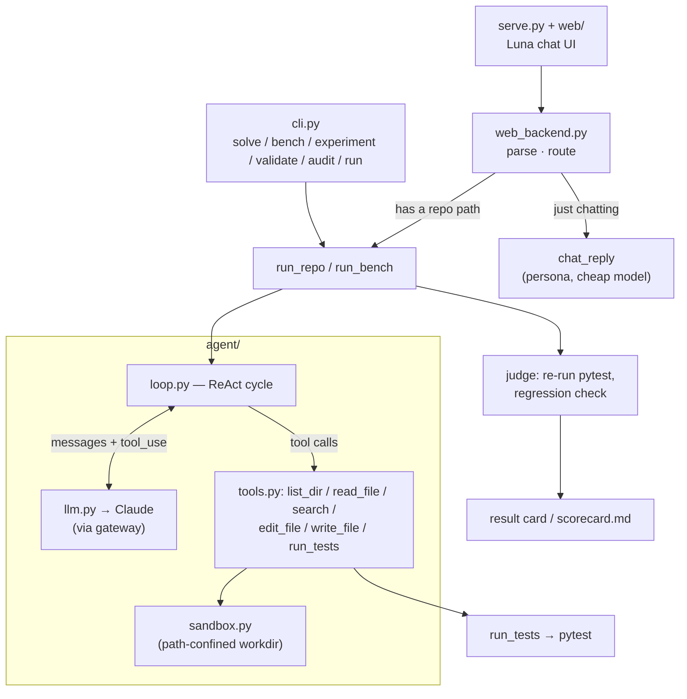
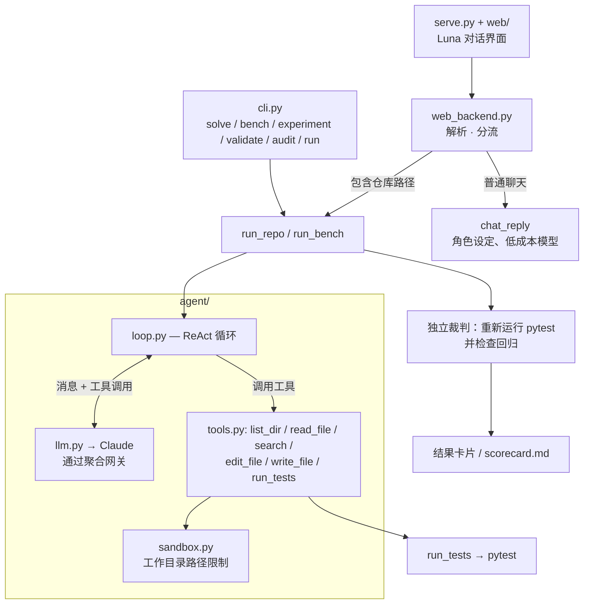

# Luna

[English](#luna) | [Chinese](#chinese-version)

> Luna is a small coding agent built to study the full repair loop: inspect a repository,
> edit source files, run tests, and use the failures to decide what to try next. A separate
> harness checks the final result. The project includes a CLI, a local chat interface, a
> controlled benchmark, and several pinned open-source repair cases.

<!-- badges: keep to 3-4, all must be real & green -->

[](https://github.com/Tsukishiro-Hitomi/Luna/actions/workflows/ci.yml)


<!-- TODO(demo.gif): record 8–15s of one task going red → agent loop → green,
     save to docs/demo.gif, then uncomment the line below.

-->

## What it is

Luna implements the basic coding-agent loop in a codebase small enough to read end to end.
Given a repository with failing tests, it searches the code, applies edits, and reruns the
tests until it stops or reaches a budget limit. Evaluation is kept outside the agent loop:
the harness restores the original tests, reruns pytest, and checks for regressions.

There are two interfaces:

- **CLI** (`cli.py`) — `solve` a benchmark task, `bench` the whole controlled set,
  `audit` committed evidence, or `run` the agent on a real git repo with failing tests.
- **Chat** (`serve.py` + `web/`) — a local web app where **Luna**, a cat-eared code
  assistant, takes a repo path in plain language, fixes the red tests, and replies with a
  result card. She'll also just chat back if you say hi.

Both use the same agent loop and repository runner.

## Features

- **Test-oracle scoring** — the model never grades itself; a separate harness re-runs
  pytest against pristine tests and flags regressions.
- **Real-repo mode** — point it at your own git repo; safe by default (clean-tree check,
  fresh branch, never commits or resets your work, prints the diff).
- **Path-confined tools** — every file op is sandboxed to the work directory; the test
  command is the only thing that runs your code.
- **Benchmark + ablations** — 30 controlled repair tasks across three independent Python
  fixtures, with offline validity gates and resumable repeated experiments.
- **Streaming, retrieval, budgets** — live token streaming, optional embedding retrieval
  to seed context, and a per-task USD cost ceiling.
- **Chat frontend** — natural-language path extraction, persona small-talk, a time-aware
  greeting, a result card, and a drop-in portrait slot — all on stdlib
  `http.server`, no extra deps.

## Architecture



## Quickstart

```bash
# Python 3.9–3.12 on macOS/Linux
python3 -m venv .venv
source .venv/bin/activate
pip install -e ".[dev]"

# optional: install the embedding-retrieval dependency too
# pip install -e ".[dev,retrieval]"

# secrets: copy the template and fill in your gateway creds
cp .env.example .env
# edit .env → set ANTHROPIC_API_KEY and ANTHROPIC_BASE_URL

# solve a single benchmark task (streams the loop to your terminal)
luna solve 001_mul_precedence

# run the whole benchmark → writes eval/scorecard.md
luna bench

# fix YOUR git repo that has failing tests (new branch, prints the diff)
luna run /path/to/repo
luna run /path/to/repo --python /path/to/repo/.venv/bin/python

# …or chat with Luna in the browser
python serve.py            # → http://127.0.0.1:8000  (Ctrl-C to stop)
```

`pip install -r requirements.txt` remains available as a compatibility path. Benchmark and
web assets intentionally live in the source checkout, so editable installation is the
recommended development setup.

## Results

The official `multi_repo_v1` campaign ran all 30 tasks three times per condition: **270
independently judged attempts** from one clean commit (`acdbc5e`) and one frozen task digest.
Harness errors remain in the denominator; this run had none.

| variant | solved attempts | solve rate (95% Wilson CI) | steps mean±sd | cost mean±sd |
|---|:---:|:---:|:---:|:---:|
| opus-4.8 baseline | 90/90 | 100% (95.9%–100%) | 6.37±0.88 | $0.1319±0.0313 |
| haiku-4.5 | 90/90 | 100% (95.9%–100%) | 8.26±1.47 | $0.0378±0.0131 |
| opus-4.8 + embedding retrieval | 90/90 | 100% (95.9%–100%) | 5.71±0.96 | $0.1468±0.0379 |

Total estimated campaign cost was **$28.49**. Every condition solved every attempt in each
fixture (expression: 36/36, config loader: 27/27, dependency planner: 27/27).

The task set still shows a ceiling effect, so the useful signal is efficiency rather than
solve-rate separation:

- **Haiku** was about **3.5× cheaper** than baseline, with 1.89 more steps on average.
- **Retrieval** saved 0.66 steps on average, but added 3,204 tokens and $0.0149 per paired
  attempt. On this dataset, the step reduction still does not pay for the injected context.

These are controlled synthetic repairs with three attempts per task, not a claim of universal
repository repair. See the committed [report](eval/artifacts/multi_repo_v1/report.md),
[summary](eval/artifacts/multi_repo_v1/summary.json), and all 270
[attempt records](eval/artifacts/multi_repo_v1/attempts.jsonl).

## Reproducibility and CI

- `pyproject.toml` provides the `luna` command and keeps embedding retrieval optional.
- GitHub Actions runs the offline suite on Python 3.9, 3.11, and 3.12, validates benchmark
  patches, and checks the committed evaluation artifacts.
- `luna audit` rebuilds summaries from the raw JSONL attempts, checks duplicate IDs and local
  paths, and validates the real-case registry.
- Real-repository cases record their commit, public issue or pull request, license, test patch,
  and run status. Their results are reported separately from the controlled benchmark.

## How it works

- **The loop** (`agent/loop.py`) — a ReAct cycle: the model sees the task, calls tools,
  observes results, iterates. Bounded by `max_steps` and a per-task USD cost budget; it
  stops when the model quits calling tools (or a guardrail trips). Optional live streaming
  and embedding retrieval to seed context.
- **The tools** (`agent/tools.py`) — `list_dir`, `read_file` (numbered lines), `search`
  (literal grep), `edit_file` (unique-match string replace), `write_file`, `run_tests`
  (pytest → compact PASS/FAIL). Every path is confined to the work directory by
  `agent/sandbox.py`; errors come back as strings, never exceptions.
- **The LLM seam** (`agent/llm.py`) — one thin wrapper over the Anthropic SDK (through an
  aggregation gateway), owning retries, streaming, and token/cost accounting. `agent/config.py`
  is the single knob panel (model, budgets, timeouts, price table).
- **The task set** (`tasks/`) — 30 repair tasks across three independent, standard-library
  Python fixtures: an expression evaluator (12 tasks / 51 tests), a layered configuration
  loader (9 / 28), and a dependency planner (9 / 22). Tasks carry fixture, difficulty, tag,
  and provenance metadata. `luna validate` proves each pristine suite is green,
  each patch turns its declared targets red, reverse-patching restores the baseline, and
  fixture source remains unchanged.
- **Scoring** (`eval/run_bench.py`) — after the agent stops, the harness restores the
  pristine test files (so a run can't cheat by editing tests), then independently re-runs the
  full `pytest`. A task is *solved* iff its target tests pass **and** no previously-green test
  newly fails (regression check).

## Repeated experiments

The `experiment` command runs resumable multi-attempt campaigns and preserves every terminal
attempt in JSONL. Reports include means, sample standard deviations, medians, 95% Wilson
intervals, per-fixture/difficulty breakdowns, and paired deltas against baseline.

```bash
luna validate
luna experiment --campaign multi_repo_v1 --attempts 3 \
  --variants baseline,haiku,retrieval --cost-cap 40 --publish
luna audit
```

Official publish mode requires a clean Git tree and writes a secret-free manifest, raw
attempts, summary, and report under `eval/artifacts/<campaign>/`. Scratch campaigns remain
ignored under `eval/results/`.

## Run on a real repo

`luna run <repo>` points the same agent at a Git repository with failing tests
(implementation: `eval/run_repo.py`):

- **Oracle = the failing tests.** It runs your suite, takes the currently-failing tests as
  the goal, edits the source, and re-runs. *Solved* = those tests pass **and** no
  previously-green test regresses. It never hunts for bugs without a failing test to prove them.
- **Safe by default.** Requires a clean tree, works on a fresh `luna/fix-<ts>` branch,
  **never commits or resets your work**, and prints the diff for you to keep or discard.
  Refuses non-git dirs, subdirectories,
  and mid-merge/rebase states. Restores any test file the agent touched before judging.
- **Uses your repo's interpreter** (`--python`, or an auto-detected `<repo>/.venv`) so the
  target's own dependencies are visible to pytest.
- **pytest by default** (per-test verdicts + regression detection); other runners work via
  `--test-cmd "…"`, judged by exit code only.

```bash
luna run ~/proj --target tests/test_x.py::test_y     # narrow the goal
luna run ~/proj --test-cmd "make test" --budget 2.0 --max-steps 60
```

### Real-repository case studies

Luna was also evaluated on the public Pallets `itsdangerous` issue
[#237](https://github.com/pallets/itsdangerous/issues/237), pinned immediately before the
upstream fix. With tracked regression tests, the repository started at 421 passed / 16 failed.
Luna repaired both `Signer` and `Serializer` in 12 steps for an estimated $0.4187; the
independent full-suite verdict was **437 passed / 0 failed / 0 regressions**. Reproduction,
provenance, license, metrics, and the generated patch are stored in
[`eval/real_cases/itsdangerous_237/`](eval/real_cases/itsdangerous_237/).

Three additional public repairs were selected and reproduced before any Luna call. Under an
explicit `$1.50` total cap, Luna solved all three for `$0.966090`; no unsuccessful run was
discarded.

| case | domain | verified pre-fix verdict | independent Luna verdict | steps | cost |
|---|---|---:|---:|---:|---:|
| Click #3578 | CLI help rendering | 1655 passed / 2 failed | 1657 passed / 0 failed | 8 | $0.211245 |
| Packaging #1345 | requirement/marker parsing | 62353 passed / 3 failed | 62356 passed / 0 failed | 7 | $0.329845 |
| cattrs #688 | nested generic structuring | 883 passed / 2 failed | 885 passed / 0 failed | 13 | $0.425000 |

The machine-readable [`eval/real_cases/index.json`](eval/real_cases/index.json) registry and
[`eval/real_cases/`](eval/real_cases/) directories preserve selection provenance, test-only
reproduction patches, pinned dependencies, generated Luna patches, and exact test scopes.
These are four transparent case studies—not controlled-benchmark pass@1 or a claim of general
repository repair.

## Chat with Luna

```bash
python serve.py            # → http://127.0.0.1:8000
```

Just tell her, in plain language: *"Fix the bug in the repo at /path/to/repo."* She pulls
the path out of the sentence, runs the exact same `run_repo` pipeline as the CLI, and replies
with a result card (baseline → fixed / regressions → branch → cost → diff). No path in your
message? She chats back in character instead of erroring.

The frontend is stdlib `http.server` with no extra deps, split by concern:

- **transport** — `serve.py`: HTTP server, routing, static file serving.
- **logic** — `web_backend.py`: `parse_message` (path extraction), `chat_reply` (persona
  small-talk on a cheap/fast model, with a canned fallback), `run_fix` (→ `run_repo`), and
  `handle_run` that routes between them. Pure dict-in/dict-out, so it's testable offline.
- **presentation** — `web/`: `index.html` / `style.css` / `app.js`, plus a hand-drawn SVG
  catgirl. A time-aware greeting (client-side), a pastel/night theme via `prefers-color-scheme`,
  and a result card. Drop any image at `assets/luna.png` (`.jpg`/`.webp` too) to use
  your own portrait — otherwise the built-in SVG is used.

**Local only** — it binds `127.0.0.1` and runs the target repo's tests (arbitrary code), so
point it only at repos you trust.

## Project layout

```text
agent/            the agent itself
  loop.py           ReAct loop (run_agent) + optional retrieval
  tools.py          list_dir / read_file / search / edit_file / write_file / run_tests
  sandbox.py        path confinement + per-task workspaces
  llm.py            Anthropic-via-gateway wrapper + token/cost accounting
  config.py         single knob panel (model, budgets, price table) + cost_of
  profile.py        remembers your name for the CLI greeting
tasks/            30 repair tasks + task authoring guide
  fixtures/         expression + config_loader + dependency_planner
eval/
  run_bench.py      the benchmark: run each task, judge, write scorecard.md
  experiment.py     resumable attempts, manifests, statistics, and reports
  audit.py          recompute published evidence + validate the real-case registry
  run_repo.py       real-repo runner (git preflight → agent → restore tests → judge)
  real_cases/       pinned real-repository reproductions and Luna patches
tests/            offline tests for the Agent, CLI/Web boundaries, harness, and evidence
cli.py            solve / bench / experiment / validate / audit / run entrypoints
serve.py          Luna chat UI — HTTP server + routing + static dispatch (thin)
web_backend.py    its logic: parse message → chat_reply / run_fix (no HTTP)
web/              its frontend: index.html + style.css + app.js
assets/           luna.* portrait (optional; falls back to the built-in SVG)
```

## Configuration

Credentials and knobs come from the environment (via `.env`):

| variable             | purpose                                                        |
|----------------------|----------------------------------------------------------------|
| `ANTHROPIC_API_KEY`  | gateway key (**required**)                                     |
| `ANTHROPIC_BASE_URL` | gateway base URL (**required**)                                |
| `LUNA_MODEL`     | override the model id (optional; defaults to opus-4.8)         |
| `LUNA_TEST_CMD`  | default test command for real-repo runs (optional)            |
| `PORT`               | chat server port (optional; default `8000`)                   |

Secrets are read straight from the environment and never enter `Config`, logs, or artifacts.

## Testing

```bash
python -m pytest -q        # all offline; agent runs are monkeypatched
luna validate             # prove every benchmark patch has the intended red/green behavior
luna audit                # recompute committed reports and validate real-case provenance
```

The suite covers tools, path confinement, the LLM wrapper, loop, config, multi-fixture
validation, experiment statistics and resume behavior, real-case artifact integrity, and the
real-repo orchestrator — none of it hits the gateway.

## Limitations & non-goals

- **Needs a failing test as the oracle.** It fixes red tests to green; it does *not*
  proactively hunt for bugs when nothing is failing (no oracle → unverifiable).
- **Structured verdicts are pytest-only.** Other runners work via `--test-cmd` but are judged
  by exit code alone (no per-test detail / regression breakdown).
- Edits are exact string replacements (`edit_file`), not fuzzy / semantic patches.
- Real-repo and chat safety is git-based (clean tree + branch + diff) and localhost-only,
  **not** a container — run only on repos you trust (the test command executes arbitrary code).
- Cost / latency depend on the aggregation gateway; it can't report output tokens under
  streaming, so `run` / `bench` use non-streaming for accurate cost.
- Not bit-reproducible: the LLM samples, so steps / cost vary run to run.
- Embedding retrieval is English-only (`bge-small-en`); its benefit here is modest (see Ablations).

## License

MIT

---

<a id="chinese-version"></a>

# 中文说明

> Luna 是我为了理解 coding agent 工作机制而写的一个小型项目。它会读取仓库、修改源码、
> 运行测试，再根据失败信息继续调整。Agent 不负责给自己判分；运行结束后，评测脚本会
> 恢复原始测试并检查回归。项目包含 CLI、本地聊天界面、受控任务集和真实开源项目案例。


[](https://github.com/Tsukishiro-Hitomi/Luna/actions/workflows/ci.yml)


<!-- TODO(demo.gif)：录制一个 8–15 秒的演示，展示单个任务从测试失败到 Agent 迭代、
     再到测试通过的过程，保存为 docs/demo.gif，然后取消下面一行的注释。

-->

## 项目内容

核心代码在 `agent/`，实现了一个 ReAct 风格的循环和六个文件/测试工具。仓库另外提供两个入口：

- `cli.py`：运行单题、批量评测、重复实验，或修复指定的 Git 仓库；
- `serve.py`：本地 Web 界面，可以从聊天内容中提取仓库路径并调用同一套修复流程。

目前实现的功能包括：

- 用 pytest 结果判断修复是否成功，并检查原本通过的测试有没有回归；
- 在真实仓库运行前检查 Git 状态，新建工作分支，不自动提交或重置用户改动；
- 将文件工具限制在目标工作目录内；
- 30 个受控修复任务、可恢复的重复实验和原始结果归档；
- 流式输出、单次运行预算，以及可选的 embedding 检索；
- 一个只监听 `127.0.0.1` 的轻量 Web 界面。

## 架构



## 快速开始

```bash
# macOS/Linux，Python 3.9–3.12
python3 -m venv .venv
source .venv/bin/activate
pip install -e ".[dev]"

# 如需使用 embedding 检索，再安装 retrieval extra
# pip install -e ".[dev,retrieval]"

# 配置模型 API
cp .env.example .env
# 在 .env 中填写 ANTHROPIC_API_KEY 和 ANTHROPIC_BASE_URL

# 运行一个受控任务
luna solve 001_mul_precedence

# 运行整个任务集，结果写入 eval/scorecard.md
luna bench

# 对已有失败测试的 Git 仓库运行 Agent
luna run /path/to/repo
luna run /path/to/repo --python /path/to/repo/.venv/bin/python

# 或者在浏览器中与 Luna 对话
python serve.py            # → http://127.0.0.1:8000（按 Ctrl-C 停止）
```

也可以继续使用 `pip install -r requirements.txt`。任务数据和 Web 静态文件都放在仓库里，
因此开发时更适合使用 editable install。

## 实验结果

`multi_repo_v1` 在同一个提交（`acdbc5e`）和同一份任务数据上运行。30 个任务在三种配置下
各重复三次，共得到 **270 条运行记录**。如果运行过程本身报错，记录仍会保留在统计分母中；
这次实验没有出现这类错误。

| 实验条件 | 已解决尝试 | 解决率（95% Wilson 区间） | 平均步数±标准差 | 平均成本±标准差 |
|---|:---:|:---:|:---:|:---:|
| opus-4.8 baseline | 90/90 | 100%（95.9%–100%） | 6.37±0.88 | $0.1319±0.0313 |
| haiku-4.5 | 90/90 | 100%（95.9%–100%） | 8.26±1.47 | $0.0378±0.0131 |
| opus-4.8 + embedding 检索 | 90/90 | 100%（95.9%–100%） | 5.71±0.96 | $0.1468±0.0379 |

整组实验的估算成本为 **$28.49**。三种配置在各 fixture 上都通过了全部运行
（表达式：36/36，配置加载器：27/27，依赖规划器：27/27）。

由于三种配置的解决率都是 100%，这套任务已经出现明显的天花板效应，不能用来比较模型能力。
目前只能比较成本和运行步数：

- Haiku 的平均成本约为 baseline 的 1/3.5，但平均多用 1.89 步。
- 开启检索后平均少用 0.66 步，同时多消耗 3,204 token 和 $0.0149。就这套任务而言，
  省下的步骤没有抵消额外上下文的成本。

这里的任务都是人为构造的小型 Python 修复题，不能代表真实仓库上的普遍表现。原始数据和统计过程
都保留在仓库中：
[实验报告](eval/artifacts/multi_repo_v1/report.md)、[统计摘要](eval/artifacts/multi_repo_v1/summary.json)
和全部 270 条[尝试记录](eval/artifacts/multi_repo_v1/attempts.jsonl)。

## 复现与 CI

- `pyproject.toml` 定义了 `luna` 命令；体积较大的检索依赖默认不安装。
- GitHub Actions 在 Python 3.9、3.11 和 3.12 上运行离线测试、任务补丁验证和产物检查。
- `luna audit` 会从 JSONL 原始记录重新计算统计结果，同时检查重复 ID、本机路径和真实案例元数据。
- 真实仓库案例单独记录，不和受控任务的解决率合并。

## 工作原理

- `agent/loop.py` 负责主循环。模型读取任务后调用工具，工具结果再作为下一轮输入。运行受
  `max_steps` 和成本预算限制；模型停止调用工具或触发限制时结束。
- `agent/tools.py` 提供目录浏览、文件读取、文本搜索、精确替换、文件写入和测试执行。
  `agent/sandbox.py` 会把这些文件操作限制在工作目录内。
- `agent/llm.py` 封装 Anthropic SDK，处理重试、流式响应和用量统计；模型、超时和价格配置集中在
  `agent/config.py`。
- `tasks/` 包含三个只依赖标准库的 Python fixture：表达式求值器（12题/51个测试）、配置加载器
  （9题/28个测试）和依赖规划器（9题/22个测试）。`luna validate` 会检查原始 fixture 全绿、
  `break.patch` 能让指定测试失败，并且反向应用补丁后可以恢复。
- `eval/run_bench.py` 负责最终判定。它先恢复被 Agent 改动过的测试，再运行完整 pytest；
  目标测试通过且没有新增失败，才记为 solved。

## 重复实验

`experiment` 用于重复运行任务。每次尝试结束后都会立即追加到 JSONL，因此进程中断后可以从已有记录
继续。汇总结果包含均值、样本标准差、中位数、95% Wilson 区间，以及按 fixture 和难度的分组数据。

```bash
luna validate
luna experiment --campaign multi_repo_v1 --attempts 3 \
  --variants baseline,haiku,retrieval --cost-cap 40 --publish
luna audit
```

加上 `--publish` 时，命令要求 Git 工作区保持干净，并把 manifest、原始记录、统计摘要和报告写到
`eval/artifacts/<campaign>/`。普通试跑写入已被忽略的 `eval/results/`。

## 在真实仓库上运行

`luna run <repo>` 可以对已有失败测试的 Git 仓库运行同一个 Agent，相关代码在 `eval/run_repo.py`。

运行前会检查仓库根目录、工作区状态以及是否存在未结束的 merge/rebase。默认要求工作区干净，
并新建 `luna/fix-<ts>` 分支；程序不会自动 commit，也不会 reset 用户文件。Agent 结束后，评测代码会
恢复它改动过的测试文件，再重新运行测试。

默认使用 pytest，这样可以记录每个测试的状态并检查回归。其他测试框架可以通过 `--test-cmd` 调用，
但这种模式只能根据进程退出码判断。Python 解释器可以用 `--python` 指定；如果仓库下存在 `.venv`，
程序会优先使用其中的解释器。

```bash
luna run ~/proj --target tests/test_x.py::test_y     # 缩小目标范围
luna run ~/proj --test-cmd "make test" --budget 2.0 --max-steps 60
```

### 真实仓库案例研究

目前记录了四个开源项目案例。每个案例都固定在上游修复前的 commit，并保存测试补丁、依赖版本、
Luna 生成的补丁和最终测试结果。

Click、Packaging 和 cattrs 是在运行 Luna 之前选定并完成红绿复现的，三次运行都保留在结果中。
三项合计成本为 `$0.966090`，低于预先设置的 `$1.50` 上限。

| 案例 | 问题 | 修复前 | 修复后 | 步数 | 成本 |
|---|---|---:|---:|---:|---:|
| itsdangerous #237 | `salt=None` 兼容性 | 421 passed / 16 failed | 437 passed / 0 failed | 12 | $0.418700 |
| Click #3578 | CLI 帮助文本渲染 | 1655 passed / 2 failed | 1657 passed / 0 failed | 8 | $0.211245 |
| Packaging #1345 | requirement/marker 解析 | 62353 passed / 3 failed | 62356 passed / 0 failed | 7 | $0.329845 |
| cattrs #688 | 嵌套泛型结构化 | 883 passed / 2 failed | 885 passed / 0 failed | 13 | $0.425000 |

具体资料见 [`eval/real_cases/`](eval/real_cases/) 和
[`index.json`](eval/real_cases/index.json)。这四个案例只用于展示和分析具体运行过程，不与受控任务
的解决率合并。样本量也不足以推断 Luna 在任意仓库上的成功率。

## 与 Luna 对话

```bash
python serve.py            # → http://127.0.0.1:8000
```

输入类似“修复 `/path/to/repo` 里的失败测试”，后端会提取路径并调用 `run_repo`。结果页显示测试基线、
修复数量、回归、工作分支、成本和 diff。没有识别到路径时，请求会进入普通聊天分支。

`serve.py` 只负责 HTTP 和静态文件；路径解析、聊天回复及仓库运行逻辑放在 `web_backend.py`，前端文件在
`web/`。界面使用标准库 `http.server`，没有额外 Web 框架。可将立绘放在 `assets/luna.png`、
`.jpg` 或 `.webp`，否则使用页面内置的 SVG。

服务只监听 `127.0.0.1`。不过它仍会执行目标仓库的测试代码，所以不要用于来源不明的仓库。

## 项目结构

```text
agent/            Agent 核心实现
  loop.py           ReAct 循环（run_agent）与可选检索
  tools.py          list_dir / read_file / search / edit_file / write_file / run_tests
  sandbox.py        路径限制与逐任务临时工作区
  llm.py            Anthropic 聚合网关封装与 token/成本统计
  config.py         模型、预算、价格表和 cost_of 的集中配置
  profile.py        记录用户名，用于 CLI 问候
tasks/            30 个修复任务 + 任务编写指南
  fixtures/         expression + config_loader + dependency_planner
eval/
  run_bench.py      运行任务、独立判定并生成 scorecard.md
  experiment.py     可恢复尝试、manifest、统计和报告
  audit.py          重算已发布证据并验证真实案例注册表
  run_repo.py       真实仓库流程：Git 预检 → Agent → 恢复测试 → 独立判定
  real_cases/       固定版本的真实仓库复现与 Luna 补丁
tests/            Agent、CLI/Web 边界、harness 与证据产物的离线测试
cli.py            solve / bench / experiment / validate / audit / run 命令入口
serve.py          Luna 对话界面：HTTP 服务、路由与静态分发
web_backend.py    解析消息并分流到 chat_reply / run_fix 的业务逻辑
web/              index.html + style.css + app.js
assets/           可选的 luna.* 立绘；不存在时使用内置 SVG
```

## 配置

凭据和运行参数通过环境变量（`.env`）提供：

| 环境变量 | 用途 |
|---|---|
| `ANTHROPIC_API_KEY` | 聚合网关密钥（**必填**） |
| `ANTHROPIC_BASE_URL` | 聚合网关地址（**必填**） |
| `LUNA_MODEL` | 覆盖模型 ID（可选，默认 opus-4.8） |
| `LUNA_TEST_CMD` | 真实仓库模式的默认测试命令（可选） |
| `PORT` | 对话服务端口（可选，默认 `8000`） |

密钥由 SDK 直接读取，不保存在 `Config` 或实验产物中。

## 测试

```bash
python -m pytest -q        # 项目测试；模型调用已替换为 mock
luna validate             # 检查任务集和 break.patch
luna audit                # 重算实验汇总并检查真实案例元数据
```

这些检查覆盖工具层、路径限制、LLM 封装、主循环、任务数据、实验恢复、统计汇总、真实案例文件和
真实仓库运行流程。CI 不访问模型 API。

## 限制与非目标

- Luna 依赖失败测试提供明确目标；测试全部通过时，它不会主动搜索其他潜在问题。
- 只有 pytest 支持逐测试结果和回归检查。`--test-cmd` 只能根据退出码判断。
- 编辑操作使用精确字符串替换，不支持模糊匹配或语义补丁。
- Git 检查和本地监听不能替代容器隔离，测试命令仍可以执行任意代码。
- 当前网关在流式响应中不返回 output token，因此 `run` 和 `bench` 默认关闭流式输出以便统计成本。
- 模型输出有随机性；同一任务重复运行时，步骤、token 和结果都可能变化。
- 检索模型 `bge-small-en` 面向英文代码语料，而且在当前任务集上没有降低成本。

## 许可证

MIT
